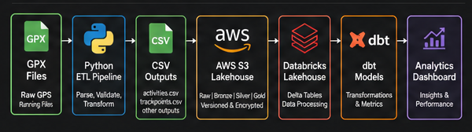

# Athlete Training Lakehouse


This project turns raw GPX running files into structured athlete training data for analytics.

## Technologies

- Python
- Git & GitHub
- Terraform
- CSV Data Engineering
- GPX Parsing
- Data Validation & Duplicate Detection

## Roadmap

- ✅ Python GPX ETL
- ✅ AWS S3 Lakehouse
- ✅ Terraform Infrastructure
- ✅ Databricks Bronze / Silver / Gold
- 🔄 dbt Analytics Engineering
- 🔄 Apache Airflow Orchestration

## Architecture Overview



## Project Goal

Build a sports performance data pipeline using Python, AWS S3, Databricks, dbt, GitHub, and Terraform concepts.

## Phase 1

Parse raw GPX files into two structured datasets:

- `activities.csv` — one row per run
- `trackpoints.csv` — one row per GPS point

### Local GPX Input

Real GPX files should be placed locally in:

```text
data/raw_gpx/Athlete A/
data/raw_gpx/Athlete B/
```

The `data/raw_gpx/` folder is ignored by Git to protect private GPS location data.

## Phase 1 Results

The initial Python ingestion pipeline parses raw GPX files into structured CSV outputs.

### Outputs Created

- `activities.csv`: all parsed activities, including duplicate flags
- `activities_clean.csv`: cleaned activity-level dataset excluding duplicate activities
- `trackpoints.csv`: GPS trackpoint-level dataset
- `pipeline_run_log.csv`: ingestion status log
- `validation_log.csv`: validation results for clean activity records

### Current Run Summary

- GPX files processed: 8
- Athletes processed: 3
- Clean activities created: 7
- Duplicate activities flagged: 1
- Validation checks run: 35
- Validation checks passed: 35
- Validation checks failed: 0

**Public sample dataset:** 42 anonymized activity records across 2 athletes.

## Safe Sample Dataset

A safe sample activity summary dataset is included in:

`data/sample/sample_activity_summary.csv`

This file contains activity-level metrics without exact GPS coordinates. It is intended to demonstrate the pipeline output structure while protecting private location data.

### Data Quality Checks

The validation script checks:

- `distance_miles` is positive
- `duration_minutes` is positive
- `trackpoint_count` is positive
- `distance_miles` is within a reasonable running range
- `duration_minutes` is within a reasonable duration range

### Pipeline Learning

During ingestion testing, one duplicate GPX activity was detected. The parser was updated to flag duplicate activities using athlete ID, activity start time, duration, and distance. This prevents duplicate raw files from inflating weekly mileage and training load metrics.

## How to Run Phase 1

From the project root:

```bash
python src/gpx_ingestion/parse_gpx.py
python src/gpx_ingestion/validate_outputs.py
```

## Data Source

Raw GPX running files exported from Strava/Garmin.

## Phase 2: AWS S3 + Terraform Infrastructure

This phase provisions an AWS S3 lakehouse landing zone using Terraform infrastructure-as-code. It demonstrates cloud infrastructure design, reproducible environments, and modern data engineering deployment practices.

The Terraform configuration defines an AWS S3 lakehouse-style landing zone with the following layout:

- `raw/gpx/` — raw GPX source files
- `bronze/` — parsed raw outputs
- `silver/` — cleaned and validated datasets
- `gold/` — analytics-ready tables
- `logs/` — pipeline and validation logs

## Phase 3: AWS S3 Lakehouse Deployment

Phase 3 deployed the Terraform-defined AWS S3 lakehouse landing zone and uploaded the safe sample dataset.

### Results

- Created S3 bucket: `athlete-training-lakehouse-alan-webb-2026`
- Enabled versioning
- Enabled server-side encryption
- Created lakehouse folder structure:
  - `raw/gpx/`
  - `bronze/`
  - `silver/`
  - `gold/`
  - `logs/`
- Uploaded safe sample dataset to:
  - `bronze/sample_activity_summary.csv`
- Verified deployment using AWS CLI.

## Phase 4: AWS S3 + Databricks Lakehouse

Overview

Phase 4 extends the Athlete Training Lakehouse by integrating AWS S3 with Databricks Unity Catalog to create a Medallion Architecture (Bronze, Silver, Gold). Training activity data is stored in Amazon S3, ingested into Databricks Delta tables, cleaned through a Silver layer, and aggregated into analytics-ready Gold tables.

This architecture mirrors the cloud data engineering patterns commonly used in modern enterprise lakehouse platforms.

## Architecture


Technologies Used
- Python
- Apache Spark
- Databricks
- Unity Catalog
- Delta Lake
- AWS S3
- IAM Roles
- SQL

Implemented

✔ Created a Unity Catalog backed by Amazon S3

✔ Configured Bronze, Silver, and Gold schemas

✔ Loaded athlete activity data directly from S3 into Delta Lake

✔ Built a Bronze Delta table containing raw activity data

✔ Built a Silver Delta table containing validated, deduplicated activities

✔ Built a Gold analytics table summarizing athlete training metrics

### Gold Layer Output

The Gold layer produces analytics-ready Delta tables containing aggregated athlete training metrics, including:

- Total activities
- Total mileage
- Average run distance
- Average run duration
- Total elevation gain
- Average elevation gain

Skills Demonstrated
- AWS S3 data lake storage
- IAM Role configuration
- Databricks Unity Catalog
- External Locations
- Spark DataFrames
- Delta Lake tables
- Medallion Architecture
- SQL aggregations
- Cloud ETL development

## Phase 5: Analytics Engineering with dbt (Planned)

Phase 5 will build reusable analytics models on top of curated Gold tables.

Planned enhancements include:

- dbt staging models
- Intermediate transformation models
- Analytics marts
- dbt tests
- dbt documentation
- Data lineage
- Reusable SQL transformations

## Phase 6: Production Pipeline Automation (Planned)

Phase 6 will automate the end-to-end lakehouse pipeline.

Planned enhancements include:

- Databricks Auto Loader
- Incremental ingestion from Amazon S3
- Apache Airflow orchestration
- Scheduled ETL pipelines
- Pipeline monitoring
- Automated logging
- End-to-end workflow automation
- Incremental ingestion from Amazon S3
- Apache Airflow orchestration
- Scheduled ETL pipelines
- Pipeline monitoring
- Automated logging
- End-to-end workflow automation