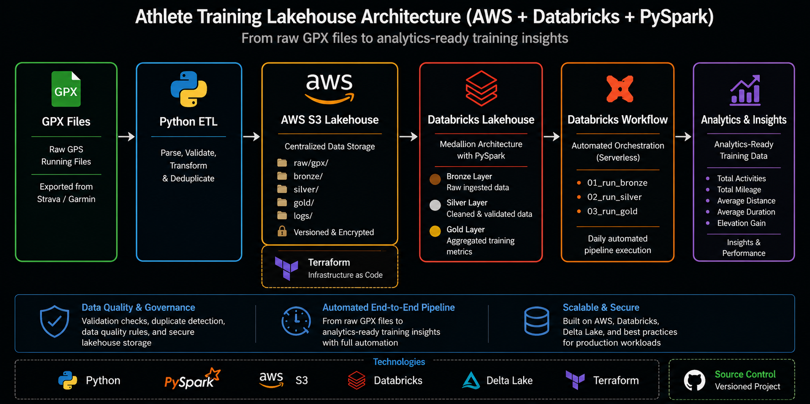
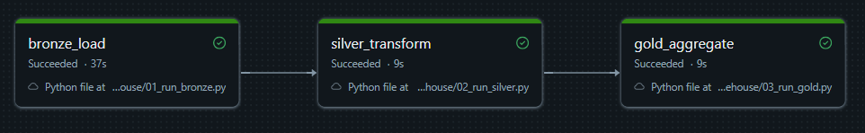
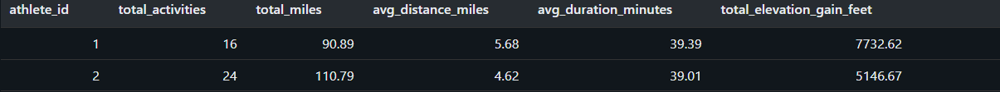

# Athlete Training Lakehouse (AWS + Databricks)


This project demonstrates an end-to-end cloud data engineering pipeline that ingests raw GPX running data, stores it in an AWS S3 lakehouse, transforms it using Databricks and PySpark, and produces analytics-ready Delta Lake tables for athlete performance reporting.

## Technologies

- Python
- PySpark
- Databricks
- Delta Lake
- AWS S3
- Terraform
- Git & GitHub
- GPX Parsing
- Data Validation
- Databricks Workflows

## Project Progress

## Project Progress

- ✅ Phase 1 – Python GPX ETL
- ✅ Phase 2 – Terraform Infrastructure
- ✅ Phase 3 – AWS S3 Lakehouse
- ✅ Phase 4 – AWS S3 + Databricks Lakehouse
- ✅ Phase 5 – Automated Bronze–Silver–Gold Pipeline

## Architecture 



## Project Goal

Build a sports performance data pipeline using Python, AWS S3, Databricks, PySpark, Delta Lake, GitHub, and Terraform.

## Phase 1: Python GPX ETL

Parse raw GPX files into two structured datasets:

- `activities.csv` — one row per run
- `trackpoints.csv` — one row per GPS point

### Local GPX Input

Real GPX files should be placed locally in:

```text
data/raw_gpx/Athlete A/
data/raw_gpx/Athlete B/
```

The `data/raw_gpx/` folder is ignored by Git to protect private GPS location data.

## Phase 1 Results

The initial Python ingestion pipeline parses raw GPX files into structured CSV outputs.

### Outputs Created

- `activities.csv`: all parsed activities, including duplicate flags
- `activities_clean.csv`: cleaned activity-level dataset excluding duplicate activities
- `trackpoints.csv`: GPS trackpoint-level dataset
- `pipeline_run_log.csv`: ingestion status log
- `validation_log.csv`: validation results for clean activity records

### Current Run Summary

- GPX files processed: 8
- Athletes processed: 3
- Clean activities created: 7
- Duplicate activities flagged: 1
- Validation checks run: 35
- Validation checks passed: 35
- Validation checks failed: 0

**Public sample dataset:** 42 anonymized activity records across 2 athletes.

## Safe Sample Dataset

A safe sample activity summary dataset is included in:

`data/sample/sample_activity_summary.csv`

This file contains activity-level metrics without exact GPS coordinates. It is intended to demonstrate the pipeline output structure while protecting private location data.

### Data Quality Checks

The validation script checks:

- `distance_miles` is positive
- `duration_minutes` is positive
- `trackpoint_count` is positive
- `distance_miles` is within a reasonable running range
- `duration_minutes` is within a reasonable duration range

### Pipeline Learning

During ingestion testing, one duplicate GPX activity was detected. The parser was updated to flag duplicate activities using athlete ID, activity start time, duration, and distance. This prevents duplicate raw files from inflating weekly mileage and training load metrics.

## How to Run Phase 1

From the project root:

```bash
python src/gpx_ingestion/parse_gpx.py
python src/gpx_ingestion/validate_outputs.py
```

## Data Source

Raw GPX running files exported from Strava/Garmin.

## Phase 2: Terraform Infrastructure

This phase provisions an AWS S3 lakehouse landing zone using Terraform infrastructure-as-code. It demonstrates cloud infrastructure design, reproducible environments, and modern data engineering deployment practices.

The Terraform configuration defines an AWS S3 lakehouse-style landing zone with the following layout:

- `raw/gpx/` — raw GPX source files
- `bronze/` — parsed raw outputs
- `silver/` — cleaned and validated datasets
- `gold/` — analytics-ready tables
- `logs/` — pipeline and validation logs

## Phase 3: AWS S3 Lakehouse

Phase 3 deployed the Terraform-defined AWS S3 lakehouse landing zone and uploaded the safe sample dataset.

### Results

- Created S3 bucket: `athlete-training-lakehouse-alan-webb-2026`
- Enabled versioning
- Enabled server-side encryption
- Created lakehouse folder structure:
  - `raw/gpx/`
  - `bronze/`
  - `silver/`
  - `gold/`
  - `logs/`
- Uploaded safe sample dataset to:
  - `bronze/sample_activity_summary.csv`
- Verified deployment using AWS CLI.

## Phase 4: AWS S3 + Databricks Lakehouse

Overview

Phase 4 extends the Athlete Training Lakehouse by integrating AWS S3 with Databricks Unity Catalog to create a Medallion Architecture (Bronze, Silver, Gold). Training activity data is stored in Amazon S3, ingested into Databricks Delta tables, cleaned through a Silver layer, and aggregated into analytics-ready Gold tables.

This architecture mirrors the cloud data engineering patterns commonly used in modern enterprise lakehouse platforms.

### Implementation

- Created a Unity Catalog backed by Amazon S3
- Configured Bronze, Silver, and Gold schemas
- Loaded athlete activity data directly from S3 into Delta Lake
- Built a Bronze Delta table containing raw activity data
- Built a Silver Delta table containing validated, deduplicated activities
- Built a Gold analytics table summarizing athlete training metrics

### Gold Layer Output

The Gold layer produces analytics-ready Delta tables containing aggregated athlete training metrics, including:

- Total activities
- Total mileage
- Average run distance
- Average run duration
- Total elevation gain
- Average elevation gain

## Phase 5: Automated Bronze–Silver–Gold Pipeline

## Objective

Build a fully automated data pipeline using the Medallion Architecture (Bronze, Silver, and Gold) in Databricks. The pipeline ingests athlete training data from Amazon S3, applies data quality transformations using PySpark, and produces athlete-level analytics using Delta Lake tables. The entire pipeline is orchestrated using Databricks Workflows running on Serverless Compute.

---

## Bronze Layer

The Bronze layer ingests raw athlete activity data from Amazon S3 into a Delta Lake table while preserving the original source data.

### Processing

- Reads CSV data from Amazon S3
- Automatically infers the schema
- Writes data as a Delta table
- Preserves the raw dataset for downstream processing

### Output Table

```text
workspace.athlete_training_lakehouse.activities_bronze
```

---

## Silver Layer

The Silver layer applies data quality rules and removes invalid records before making the data available for analytics.

### Transformations

- Removes activities with invalid distances
- Removes activities with invalid durations
- Removes activities with invalid trackpoint counts
- Removes duplicate activities
- Writes cleaned data to a Delta table

### Output Table

```text
workspace.athlete_training_lakehouse.activities_silver
```

---

## Gold Layer

The Gold layer aggregates activity data into athlete-level business metrics for reporting and analytics.

### Metrics Produced

- Total Activities
- Total Miles
- Average Distance
- Average Duration
- Total Elevation Gain

### Output Table

```text
workspace.athlete_training_lakehouse.athlete_training_summary
```

---

## Databricks Workflow

The complete pipeline is orchestrated using **Databricks Workflows**, ensuring each stage executes only after the previous stage completes successfully.

The workflow runs on **Databricks Serverless Compute**, eliminating the need to manually provision or manage compute resources while automatically scaling execution.

---

## Pipeline Results

Successful workflow execution produced the following results:

| Task | Runtime | Rows Written |
|------|---------:|-------------:|
| Bronze Load | 40.1 seconds | 40 |
| Silver Transformation | 11.7 seconds | 40 |
| Gold Aggregation | 14.9 seconds | 2 |

**Total Pipeline Runtime:** **66.7 seconds**

The Gold layer successfully produced athlete-level summary metrics for two athletes from the sample training dataset.

---

## Skills Demonstrated

- Python
- PySpark
- Databricks Workflows
- Delta Lake
- Unity Catalog
- Amazon S3
- Terraform
- Medallion Architecture
- Data Quality Validation
- Cloud Data Engineering

---

## Screenshots

---

## Automated Databricks Workflow



The Databricks Workflow orchestrates the complete Bronze → Silver → Gold pipeline using serverless compute. Each stage executes only after the previous stage completes successfully.

---

## Gold Layer Output



The Gold layer contains analytics-ready training metrics including total activities, mileage, average distance, duration, and elevation gain for each athlete.

## Key Takeaways

This project demonstrates an end-to-end cloud data engineering workflow—from parsing raw GPX files with Python to provisioning cloud infrastructure with Terraform, storing data in Amazon S3, transforming it with Databricks and PySpark, and orchestrating an automated Bronze–Silver–Gold pipeline using Databricks Workflows. The result is a production-style analytics pipeline that follows modern lakehouse and cloud data engineering best practices.